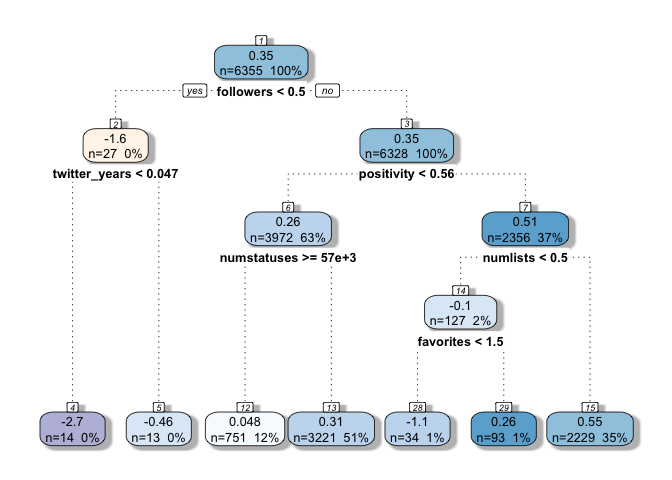

# Sentiment and Principal Component Analysis of Twitter Data: Microsoft Study
David Rodriguez  
February 24, 2016  

## Introduction

Twitter is a powerful tool that enables users to communicate with others and also empowers data scientists with large quantities of data they can use. Communications on twitter are live and dynamic, changing every second. They are also short, limited to 140 characters. The analysis of such short, fast-moving data can reveal how people communicate on a particular subject.

For this analysis, I have chosen to gather recent English-language tweets containing the word 'microsoft'. This allows me to explore how people regard the microsoft brand, as well as how they treat any news articles referring to microsoft. In practice, this methodology can be employed to any other broadly tweeted topic, including politics and popular culture.

The ultimate goal of any analysis is to be able to predict some quantity of interest. For my purposes, I wished to examine if I could predict how users would tweet about the specified subject based on information publicly available from Twitter.

## Experiment Setup

Load up required packages:

```r
library(twitteR)
library(tm)
library(rjson)
library(wordcloud)
library(dplyr)
library(caret)
library(knitr)
library(RColorBrewer)
library(stringr)
library(syuzhet) # for sentiment analysis
library(rattle)
library(lubridate)
library(rpart)
library(randomForest)
library(glmnet)
```

To access twitter, I need to provide authorization credentials for my Twitter application:

```r
secrets <- fromJSON(file='twitter_secrets.json.nogit')

setup_twitter_oauth(secrets$api_key,
                    secrets$api_secret,
                    secrets$access_token,
                    secrets$access_token_secret)
```

```
## [1] "Using direct authentication"
```

Perform a twitter search and extract the information I want:

```r
searchstring <- 'microsoft'
numtweets <- 10000
st <- searchTwitter(searchstring, n=numtweets, resultType = 'recent', lang = 'en')

statuses <- data.frame(text=sapply(st, function(x) x$getText()),
                       user=sapply(st, function(x) x$getScreenName()),
                       RT=sapply(st, function(x) x$isRetweet),
                       latitude=sapply(st, function(x) as.numeric(x$latitude[1])),
                       longitude=sapply(st, function(x) as.numeric(x$longitude[1])),
                       time=sapply(st, function(x) format(x$created, format='%F %T'))
                       )
```

Remove retweets for clarity:

```r
statuses <-
    statuses %>%
    filter(!RT)
```

Save tweets for future use:

```r
today <- format(Sys.time(), '%Y-%m-%d')
savename <- paste0('data/tweets_',searchstring,'_',
                   nrow(statuses),'_',today,'.Rda')
saveRDS(statuses, file=savename)
```

Alternatively, I load up prior searches to avoid re-running:

```r
files <- list.files('data','tweets_')
searchstring <- 'microsoft'
rm(statuses)
```

```
## Warning in rm(statuses): object 'statuses' not found
```

```r
for(i in 1:length(files)) {
    selectedfile <- paste0('data/',files[i])
    print(selectedfile)
    if(!exists('statuses')){
        statuses <- readRDS(file=selectedfile)
    }else{
        statuses <- rbind(statuses, readRDS(file=selectedfile))
    }
}
```

```
## [1] "data/tweets_microsoft_6364_2016-02-29.Rda"
## [1] "data/tweets_microsoft_6768_2016-03-01.Rda"
```

Total number of tweets to process is 13132

## Text Analysis

Gather the tweets:

```r
textdata <- Corpus(VectorSource(statuses$text))

textdata <- 
    textdata %>%
    tm_map(removeWords, stopwords("english"), mc.cores=1) %>%
    tm_map(removePunctuation, mc.cores=1) %>%
    tm_map(content_transformer(function(x) iconv(x, to='UTF-8-MAC', sub='byte')),
           mc.cores=1) %>%
    tm_map(content_transformer(tolower), mc.cores=1) %>%
    tm_map(content_transformer(function(x) str_replace_all(x, "@\\w+", "")), 
           mc.cores=1) %>% # remove twitter handles
    tm_map(removeNumbers, mc.cores=1) %>%
    tm_map(removeWords, c('trump','realdonaldtrump'), mc.cores=1) %>%
    tm_map(stemDocument) %>%
    tm_map(stripWhitespace, mc.cores=1)

save(textdata, file = 'data/testdata_corpus.RData') 
rm(textdata)
```


```r
load('data/testdata_corpus.RData') 
```


I also perform a sentiment analysis on the text data by comparing the words with those from the [NRC Word-Emotion Association Lexicon](http://saifmohammad.com/WebPages/NRC-Emotion-Lexicon.htm), which assigns them two 8 emotions (eg, anger, joy, etc) and 2 sentiments (postive and negative). I create a new variable, positivity, which is the difference between the positive and negative sentiments.

```r
sentiments <- sapply(textdata, function(x) get_nrc_sentiment(as.character(x)))

sentiments <- as.data.frame(aperm(sentiments)) # transpose and save as dataframe
sentiments <- as.data.frame(lapply(sentiments, as.numeric)) # a bit more to organize
sentiments <-
    sentiments %>%
    mutate(positivity = positive - negative)
```

A quick wordcloud of the tweets reveals the 100 key words used:

```r
pal2 <- brewer.pal(8,"RdBu")
wordcloud(textdata, max.words = 100, colors= pal2, random.order=F, 
          rot.per=0.1, use.r.layout=F)
```

 

And here are the emotions expressed in these tweets:

```r
emotions <- data.frame("count"=colSums(sentiments[,c(1:8)]))
emotions <- cbind("sentiment" = rownames(emotions), emotions)

ggplot(data = emotions, aes(x = sentiment, y = count)) +
    geom_bar(aes(fill = sentiment), stat = "identity") +
    xlab("Sentiment") + ylab("Total Count") + 
    scale_fill_brewer(palette='RdBu') + 
    theme_bw() + theme(legend.position='none')
```

 

Further processing to get word counts:

```r
dtm <- DocumentTermMatrix(textdata)
dtm <- inspect(dtm)

save(dtm, file = 'data/DocumentTermMatrix.RData') 
rm(dtm)
```


```r
load('data/DocumentTermMatrix.RData') 
```

Sort in descending order to find the most common terms:

```r
words <- data.frame(term = colnames(dtm))
words$count <- colSums(dtm)

words <-
    words %>%
    arrange(desc(count))
head(words)
```

```
##        term count
## 1 microsoft 11856
## 2    window  2311
## 3      xbox  2255
## 4   hololen  1721
## 5      game  1599
## 6       new  1192
```

Convert tweets to data frame and select only the top 100 words to process:

```r
tweets <- as.data.frame(dtm)
ind <- data.frame('id'=seq.int(nrow(tweets)))
tweets <- cbind(ind, tweets)

words_100 <- as.character(words[2:101,'term'])
tweets <- tweets[,c('id',words_100)]

save(tweets, file = 'data/tweets.RData') 
rm(tweets, dtm)
```


```r
rm(dtm, textdata)
load('data/tweets.RData') 
```

## Principal Component Analysis

Perform a principal component analysis on the tweet data set and join the information (first 5 components) to the original status array.

```r
trans <- preProcess(tweets[,2:ncol(tweets)], method=c("pca"), thresh = 0.95)
pca <- predict(trans, tweets[,2:ncol(tweets)])
statuses <- cbind(statuses, pca[,1:5], sentiments)
```

I now examine the reprojected data:

```r
pal2 <- brewer.pal(10,"RdBu")
ggplot(statuses, aes(x=PC1, y=PC2)) + 
    geom_point(aes(fill=positivity), size=4, alpha=0.7, pch=21, stroke=1.3) + 
    scale_fill_gradientn(colours = pal2, limits=c(-5,5)) + theme_bw()
```

 

Sometimes the other principal components are more illustrative:

```r
pal2 <- brewer.pal(10,"RdBu")
ggplot(statuses, aes(x=PC2, y=PC3)) + 
    geom_point(aes(fill=positivity), size=4, alpha=0.7, pch=21, stroke=1.3) + 
    scale_fill_gradientn(colours = pal2, limits=c(-5,5)) + theme_bw()
```

 

I remove outliers, which I define as the 2% highest and lowest PC values in terms of PC1 and PC2:

```r
cutlevel <- 2/100.
cut1 <- quantile(statuses$PC1, probs=c(cutlevel,1-cutlevel))
cut2 <- quantile(statuses$PC2, probs=c(cutlevel,1-cutlevel))

statuses <- 
    statuses %>%
    filter(PC1>cut1[1] & PC1<cut1[2]) %>%
    filter(PC2>cut2[1] & PC2<cut2[2])
```


The loading factors reveal how important each term is to the principal component axes. Here are the top few terms of the first two components:

```r
loadings <- trans$rotation 
load_sqr <- loadings^2

load_sqr <- data.frame(load_sqr)
temp <- data.frame('term'=rownames(load_sqr))
load_sqr <- cbind(temp, load_sqr)
load_sqr %>%
    select(term, PC1) %>%
    arrange(desc(PC1)) %>%
    head(10) %>% kable
```


term             PC1
--------  ----------
restor     0.0983066
slam       0.0977344
epic       0.0971905
faith      0.0969293
human      0.0939914
ballmer    0.0914452
steve      0.0911956
dunk       0.0891933
former     0.0891634
ceo        0.0869296

```r
load_sqr %>%
    select(term, PC2) %>%
    arrange(desc(PC2)) %>%
    head(10) %>% kable
```


term              PC2
---------  ----------
fun         0.1589405
csrrace     0.1557036
have        0.1487819
join        0.1443763
play        0.1277830
free        0.1087408
window      0.0359545
hololen     0.0129898
develop     0.0115247
preorder    0.0098478

I've created a function to sample tweets across the PC spectrum.

```r
set.seed(42)
tweet_check <- function(text, pc, numbreaks=5){
    cuts <- cut(pc, numbreaks)
    #cuts <- cut(pc, breaks=quantile(pc, probs=seq(0,1,1/numbreaks)))
    temp <- data.frame(text=text, pc=pc, pc_val=cuts)
    temp <- temp %>%
        group_by(pc_val) %>%
        summarise(text=iconv(sample(text,1), to='UTF-8-MAC', sub='byte')) %>%
        filter(!is.na(pc_val))
    return(temp)
}
```

Here are the results for PC1:

```r
tweet_check(statuses$text, statuses$PC1, 10) %>% kable(format='html')
```

<table>
 <thead>
  <tr>
   <th style="text-align:left;"> pc_val </th>
   <th style="text-align:left;"> text </th>
  </tr>
 </thead>
<tbody>
  <tr>
   <td style="text-align:left;"> (-15.2,-13.6] </td>
   <td style="text-align:left;"> Former Microsoft CEO Steve Ballmer's epic slam dunk will restore your faith in humanity https://t.co/3hG1xHevnX via @mashable </td>
  </tr>
  <tr>
   <td style="text-align:left;"> (-13.6,-11.9] </td>
   <td style="text-align:left;"> DigitalLife: Former Microsoft CEO Steve Ballmer's epic slam dunk will restore your faith in huma... https://t.co/pzOBFJzqDR #ICTChallenge </td>
  </tr>
  <tr>
   <td style="text-align:left;"> (-11.9,-10.3] </td>
   <td style="text-align:left;"> Former Microsoft CEO Steve Ballmers epic slam dunk will restore your fai... https://t.co/FCZkoPWBIv #business #money https://t.co/GCwP8QWUAd </td>
  </tr>
  <tr>
   <td style="text-align:left;"> (-10.3,-8.61] </td>
   <td style="text-align:left;"> Former Microsoft CEO Steve Ballmer's epic slam dunk will… https://t.co/eIcrzOig6o #LosAngelesClippers #SteveBallmer #Microsoft #Buisness </td>
  </tr>
  <tr>
   <td style="text-align:left;"> (-6.96,-5.31] </td>
   <td style="text-align:left;"> And, Uh, Here's Former Microsoft CEO Steve Ballmer Dunking https://t.co/DVsKjwmOA9 https://t.co/mN9eJG2M8i </td>
  </tr>
  <tr>
   <td style="text-align:left;"> (-5.31,-3.66] </td>
   <td style="text-align:left;"> Damn, Ballmer. The former Microsoft CEO is at it again with an amazing dunk. https://t.co/sR4I023VzZ … https://t.co/DuKE43dxl7 </td>
  </tr>
  <tr>
   <td style="text-align:left;"> (-3.66,-2.01] </td>
   <td style="text-align:left;"> Ballmer's dunk is hilarious https://t.co/4pDlmi8WEf </td>
  </tr>
  <tr>
   <td style="text-align:left;"> (-2.01,-0.365] </td>
   <td style="text-align:left;"> Microsoft Windows Shop Slammed For Trying To Merge Gaming Ecosystem: Microsoft who is set to roll out a TV in ... https://t.co/wovRQXqKVo </td>
  </tr>
  <tr>
   <td style="text-align:left;"> (-0.365,1.3] </td>
   <td style="text-align:left;"> Pardon my French, but if the Xbox One is going to become even MORE like a PC then Microsoft can fuck right off. </td>
  </tr>
</tbody>
</table>

And here are the results for PC2:

```r
set.seed(42)
tweet_check(statuses$text, statuses$PC2, 10) %>% kable(format='html')
```

<table>
 <thead>
  <tr>
   <th style="text-align:left;"> pc_val </th>
   <th style="text-align:left;"> text </th>
  </tr>
 </thead>
<tbody>
  <tr>
   <td style="text-align:left;"> (-4.36,-3.67] </td>
   <td style="text-align:left;"> You won't need an Xbox to play Microsoft's next generation of games - CNET: Microsoft will bring games to… https://t.co/RBKOFOO4WO |Cnet </td>
  </tr>
  <tr>
   <td style="text-align:left;"> (-3.67,-2.99] </td>
   <td style="text-align:left;"> You won’t need an Xbox to play Microsoft’s next generation of games – CNET https://t.co/MTiNFAPoaj </td>
  </tr>
  <tr>
   <td style="text-align:left;"> (-2.99,-2.3] </td>
   <td style="text-align:left;"> You won't need an Xbox to play Microsoft's next generation ...   https://t.co/UMKXPtMODE [https://t.co/0j0RONeotm]&amp;lt;-Promo Code </td>
  </tr>
  <tr>
   <td style="text-align:left;"> (-2.3,-1.62] </td>
   <td style="text-align:left;"> Have to say Steve Ballmer is really redeeming himself. I once compared him to Comic Sans but he's getting better  https://t.co/v8yO2jwnru </td>
  </tr>
  <tr>
   <td style="text-align:left;"> (-1.62,-0.933] </td>
   <td style="text-align:left;"> Use #SAS Add-in for Microsoft Office to query data &amp;amp; run stored processes. Free webinar 3/3 #AsktheExpert #SASusers https://t.co/vMaa6pMbzu </td>
  </tr>
  <tr>
   <td style="text-align:left;"> (-0.933,-0.248] </td>
   <td style="text-align:left;"> New on #MVA: Get Swaying! Microsoft Sway In Education https://t.co/Ax2D2KfBBp #Free #Training </td>
  </tr>
  <tr>
   <td style="text-align:left;"> (-0.248,0.436] </td>
   <td style="text-align:left;"> @MightyPupil @CreatineAvenger @Microsoft @surface you could not be more wrong let my Kool Aid tell you </td>
  </tr>
  <tr>
   <td style="text-align:left;"> (0.436,1.12] </td>
   <td style="text-align:left;"> Microsoft Invites Devs to Tinker With HoloLens https://t.co/nhR4z906rT </td>
  </tr>
  <tr>
   <td style="text-align:left;"> (1.12,1.8] </td>
   <td style="text-align:left;"> Introducing first ever experiences for the Microsoft HoloLens Development Edition https://t.co/SHVizqcQCG  #hololens #augmentedreality #vr </td>
  </tr>
  <tr>
   <td style="text-align:left;"> (1.8,2.5] </td>
   <td style="text-align:left;"> First Hololens kit to cost $3,000: Microsoft starts taking orders for the developers' edition of its Hololens ... https://t.co/qCT6WrtvVW </td>
  </tr>
</tbody>
</table>

Finally, let's have a look at tweets grouped by positivity score:

```r
tweet_check(statuses$text, statuses$positivity, 10) %>% kable(format='html')
```

<table>
 <thead>
  <tr>
   <th style="text-align:left;"> pc_val </th>
   <th style="text-align:left;"> text </th>
  </tr>
 </thead>
<tbody>
  <tr>
   <td style="text-align:left;"> (-4.01,-3.2] </td>
   <td style="text-align:left;"> microsoft, while kicking conker in the crotch: conker is a much beloved property. *begins shooting him with a gun* beloved *murders him* be </td>
  </tr>
  <tr>
   <td style="text-align:left;"> (-3.2,-2.4] </td>
   <td style="text-align:left;"> Windows 10 is shit and Microsoft can suck my taint. </td>
  </tr>
  <tr>
   <td style="text-align:left;"> (-2.4,-1.6] </td>
   <td style="text-align:left;"> Microsoft Attacks Apple, Google Crashes a Car Into a Bus… [Tech News Digest] https://t.co/3PMdcpCLeE https://t.co/a3mzFGTn78 </td>
  </tr>
  <tr>
   <td style="text-align:left;"> (-1.6,-0.8] </td>
   <td style="text-align:left;"> Microsoft acquisition opens door for cross platform mobile appdev, by @jrdothoughts from @CIOonline @IDGCN https://t.co/HqbLJ6IXMW </td>
  </tr>
  <tr>
   <td style="text-align:left;"> (-0.8,0] </td>
   <td style="text-align:left;"> Microsoft highlights what Macs can’t do in new Windows 10 buggy ad https://t.co/7auGC50Vfo via @verge </td>
  </tr>
  <tr>
   <td style="text-align:left;"> (0.8,1.6] </td>
   <td style="text-align:left;"> Display live updating data from your desktop Microsoft #Excel spreadsheets in your #WordPress blog. https://t.co/TLfdCcPH7G #WordPress </td>
  </tr>
  <tr>
   <td style="text-align:left;"> (1.6,2.4] </td>
   <td style="text-align:left;"> Hands-on: Microsoft Lumia 550 second impressions; the best budget Lumia offering to date https://t.co/uRu0Wjrajp https://t.co/UqglYKnKjZ </td>
  </tr>
  <tr>
   <td style="text-align:left;"> (2.4,3.2] </td>
   <td style="text-align:left;"> February 29th, 2016: I've learned how to correctly spell &quot;particularly&quot; without assistance from Microsoft Word and/or Google </td>
  </tr>
  <tr>
   <td style="text-align:left;"> (3.2,4.01] </td>
   <td style="text-align:left;"> Applied Microsoft Excel Course: Learn to master the commonly used functions and formulas in Microsoft Excel. https://t.co/TRzytt6RSi </td>
  </tr>
</tbody>
</table>

## Gather User Data

Now, I gather all the user data for each particular tweet.

```r
userlist <- sapply(unique(statuses$user), as.character)
allusers <- lookupUsers(userlist)

# Gather all the user info in a data frame
userinfo <- data.frame(user=sapply(allusers, function(x) x$screenName),
                       realname=sapply(allusers, function(x) x$name),
                       numstatuses=sapply(allusers, function(x) x$statusesCount),
                       followers=sapply(allusers, function(x) x$followersCount),
                       friends=sapply(allusers, function(x) x$friendsCount),
                       favorites=sapply(allusers, function(x) x$favoritesCount),
                       account_created=sapply(allusers, function(x) format(x$created, 
                                                              format='%F %T')),
                       verified=sapply(allusers, function(x) x$verified),
                       numlists=sapply(allusers, function(x) x$listedCount)) %>%
    mutate(user=as.character(user)) %>%
    mutate(twitter_years=interval(account_created, Sys.time()) / dyears(1)) %>%
    select(-account_created)

save(userinfo, file='data/userinfo.Rdata')
#rm(userinfo)
```


```r
load('data/userinfo.Rdata')
```

The original tweets are grouped together by user (taking averages of the relevant quantities of interest) and then joined together to the user information data frame:

```r
newstatuses <-
    statuses %>%
    group_by(user) %>%
    summarize(numTopicTweets=n(),
              positivity=mean(positivity),
              PC1=mean(PC1),
              PC2=mean(PC2),
              PC3=mean(PC3),
              PC4=mean(PC4),
              PC5=mean(PC5),
              client=rownames(sort(table(client), decreasing = T))[1],
              anger=mean(anger), anticipation=mean(anticipation), 
              disgust=mean(disgust), fear=mean(fear), joy=mean(joy),
              sadness=mean(sadness), surprise=mean(surprise), trust=mean(trust)) %>% 
    mutate(user=as.character(user))

# Join the data together
alldata <- inner_join(userinfo, newstatuses, by='user')
```

## Predictive Analysis

### Setup

I'll now decide on the quantity to predict and clean up the table to be able to run my models.
I'll choose to examine the 2nd principal component, but this can readily be changed to the other components or the positivity.

```r
possiblepreds <- c('PC1','PC2','PC3','PC4','PC5')
choice <- 'PC2'

# Remove columns
if(T){
    colremove <- possiblepreds[sapply(possiblepreds, function(x) x!=choice)]
    col_list <- colnames(alldata)
    final_cols <- col_list[sapply(col_list, function(x) !(x %in% colremove))]
    df <- alldata[final_cols]
}else{
    df <- alldata
}

df <- df %>% 
    select(-user, -realname, -client) %>%
    select(-(anger:trust)) # removing sentiment columns
```

In the event that there are parameters with little variance, I remove them:

```r
nzv <- nearZeroVar(df)
df_filter <- df[, -nzv]
df_filter <- na.omit(df_filter)
```

There are now only 9 parameters, including PC2.

I now prepare my training and test data sets:

```r
set.seed(3456)
trainIndex <- sample(nrow(df_filter), nrow(df_filter)*0.8)

df_train <- df_filter[ trainIndex,]
df_test  <- df_filter[-trainIndex,]
```

### Regression Tree

First, I'll run a regression tree model:

```r
rtGrid <- expand.grid(cp=seq(0.005, 0.1, by = 0.005)) # grid of cp values
ctrl <- trainControl(method = "cv", number = 10, verboseIter = F)

toRun <- formula(paste0(choice,' ~ .'))
rtTune <- train(toRun, data = df_train, method = "rpart", 
                tuneGrid = rtGrid, trControl = ctrl)
final_tree <- rtTune$finalModel
```

The numeric values of our best fit are saved for later comparison:

```r
df_test_all <- df_test
df_test_all[,'id'] <- seq(nrow(df_test_all))
pr_rt <- predict(rtTune, newdata = df_test)
rmseTree <- RMSE(pr_rt, df_test[,choice])
modelSummary <- data.frame(model='Regression Tree',
                         RMSE=rmseTree)

df_test_all[,'diff_Tree'] = df_test_all[,choice] - pr_rt
```

### Generalized Linear Model

I next run a generalized linear model:

```r
toRun <- formula(paste0(choice,' ~ .'))
rtTune2 <- train(toRun, data = df_train, method = "glm")

glm_summary <- summary(rtTune2)
```

As before, we save the results for future comparison:

```r
pr_rt <- predict(rtTune2, newdata = df_test)
rmseGLM <- RMSE(pr_rt, df_test[,choice])
    
newRow <- data.frame(model='Generalized LM',
                     RMSE=rmseGLM)
modelSummary <- rbind(modelSummary, newRow)
    
df_test_all[,'diff_GLM'] = df_test_all[,choice] - pr_rt
```

### Random Forest

Next, I run a random forest model:

```r
rtGrid = expand.grid(mtry=seq(3, 7, by = 1)) # grid of mtry values
ctrl <- trainControl(method = "cv", number = 5, verboseIter = F)

toRun <- formula(paste0(choice,' ~ .'))
rtTune3 <- train(toRun, data = df_train, 
                method = "rf",
                tuneGrid = rtGrid,
                trControl = ctrl, importance=T)
```

The best random forest model considers 3 random parameters at each split. This is the overall importance of the various parameters:

```r
varImp(rtTune3)
```

```
## rf variable importance
## 
##                Overall
## positivity      100.00
## numlists         61.42
## followers        48.05
## numstatuses      41.74
## favorites        32.22
## twitter_years    22.83
## friends          22.06
## numTopicTweets    0.00
```


```r
pr_rt <- predict(rtTune3, newdata = df_test)
rmseRF <- RMSE(pr_rt, df_test[,choice])
    
newRow <- data.frame(model='Random Forest',
                     RMSE=rmseRF)
modelSummary <- rbind(modelSummary, newRow)
    
df_test_all[,'diff_RF'] = df_test_all[,choice] - pr_rt
```

### GLMNET

Finally, I consider another generalized linear model with an elastic-net penalty that controls whether we are considering a lasso or ridge regression:

```r
enetGrid <- expand.grid(.alpha = c(0, 0.1, 0.5, 0.7, 1), 
                        .lambda = seq(0, 5, by = 0.1))

ctrl <- trainControl(method = "cv", number = 10, verboseIter = F)

toRun <- formula(paste0(choice,' ~ .'))
rtTune4 <- train(toRun, data = df_train,    
                  method = "glmnet", 
                  tuneGrid = enetGrid,
                  trControl = ctrl)
```

The best alpha and lambda parameters for the GLMNET model are 0.1, 0.1


```r
pr_rt <- predict(rtTune4, newdata = df_test)
rmseGLMNET <- RMSE(pr_rt, df_test[,choice])
    
newRow <- data.frame(model='GLMNET',
                     RMSE=rmseGLMNET)
modelSummary <- rbind(modelSummary, newRow)
    
df_test_all[,'diff_GLMNET'] = df_test_all[,choice] - pr_rt
```


## Model Comparison

The figure below compares the result of the various models:

```r
cols <- c("RTree"="dark green", "GLM"="dark blue",
          "RForest"="dark orange", "GLMNET"="dark red")
alphalvl <- 0.3
ggplot(data=df_test_all, aes(x=id)) +
    geom_point(aes(y=diff_Tree, color='RTree'), alpha=alphalvl) + 
    geom_hline(yintercept=c(rmseTree, -1*rmseTree), color=cols['RTree']) +
    geom_point(aes(y=diff_GLM, color='GLM'), alpha=alphalvl) + 
    geom_hline(yintercept=c(rmseGLM, -1*rmseGLM), color=cols['GLM']) +
    geom_point(aes(y=diff_RF, color='RForest'), alpha=alphalvl) + 
    geom_hline(yintercept=c(rmseRF, -1*rmseRF), color=cols['RForest']) +
    geom_point(aes(y=diff_GLMNET, color='GLMNET'), alpha=alphalvl) + 
    geom_hline(yintercept=c(rmseGLMNET, -1*rmseGLMNET), color=cols['GLMNET']) +
    theme_bw() + coord_cartesian(ylim=c(-2,2)) + 
    scale_colour_manual(name="Model",values=cols) +
    labs(x='Twitter User', y='Difference from Model')
```

 

Here is a table of the root mean square errors (RMSE), a measure of the goodness-of-fit:

```r
modelSummary %>% kable(format='html')
```

<table>
 <thead>
  <tr>
   <th style="text-align:left;"> model </th>
   <th style="text-align:right;"> RMSE </th>
  </tr>
 </thead>
<tbody>
  <tr>
   <td style="text-align:left;"> Regression Tree </td>
   <td style="text-align:right;"> 0.7290474 </td>
  </tr>
  <tr>
   <td style="text-align:left;"> Generalized LM </td>
   <td style="text-align:right;"> 0.7281301 </td>
  </tr>
  <tr>
   <td style="text-align:left;"> Random Forest </td>
   <td style="text-align:right;"> 0.7065228 </td>
  </tr>
  <tr>
   <td style="text-align:left;"> GLMNET </td>
   <td style="text-align:right;"> 0.7291258 </td>
  </tr>
</tbody>
</table>


## Summary

I have looked at tweets concerning microsoft and have identified that the second principal component (PC2) appears to be relevant to sorting tweets by whether or not they are excited about the Hololens product or Xbox games on their personal computers. 
While in principle, there are a lot of tweets and variations, I choose to use PC2 as a measure of the phrases used and developed a set of models to attempt to predict what values of PC2 a user would have. 

This approach can be useful to determine what types of users are excited about the Hololens and which are excited about Xbox games (in this example) and can suggest targetted advertizing.

Let's have a look at the regression tree as it's one of the clearest to describe:

```r
fancyRpartPlot(final_tree, palettes=c("Blues"), sub='')
```

 

The above suggests that users with very negative PC2 values (associated with excitement about the Xbox product) also have very few followers and have been on Twitter a very small amount of time. This suggest these types of users are actually Twitter robot accounts created to spam advertisement on this particular Xbox news story. I would argue it's safe to disregard spending any advertising efforts on these users.

On the other hand, for higher PC2 values (associated with excitement about the Hololens product), we can see more meaningful information. The value of PC2 for a user depends on the postivity, which is a measure on how often positive and negative words are used; the number of statuses or tweets they've had; the number of lists they follow; and the number of favorites they have.

We can also have a look at the summary of results for the generalized linear model:

```r
glm_summary
```

```
## 
## Call:
## NULL
## 
## Deviance Residuals: 
##     Min       1Q   Median       3Q      Max  
## -4.7862  -0.1446   0.0531   0.2858   2.1457  
## 
## Coefficients:
##                  Estimate Std. Error t value Pr(>|t|)    
## (Intercept)     3.224e-01  2.039e-02  15.807  < 2e-16 ***
## numstatuses    -3.985e-07  7.850e-08  -5.077 3.94e-07 ***
## followers      -5.819e-08  8.663e-08  -0.672    0.502    
## friends         2.743e-06  1.776e-06   1.545    0.122    
## favorites      -3.623e-07  1.051e-06  -0.345    0.730    
## numlists        1.041e-05  7.607e-06   1.368    0.171    
## twitter_years   2.088e-03  3.948e-03   0.529    0.597    
## numTopicTweets -2.412e-03  4.920e-03  -0.490    0.624    
## positivity      9.551e-02  1.116e-02   8.559  < 2e-16 ***
## ---
## Signif. codes:  0 '***' 0.001 '**' 0.01 '*' 0.05 '.' 0.1 ' ' 1
## 
## (Dispersion parameter for gaussian family taken to be 0.6228807)
## 
##     Null deviance: 4019.6  on 6354  degrees of freedom
## Residual deviance: 3952.8  on 6346  degrees of freedom
## AIC: 15037
## 
## Number of Fisher Scoring iterations: 2
```

This suggests the most significant quantities to predict the values of PC2 are the number of statuses or tweets and the positivity value. 

While these models can predict the values of PC2, their errors remain fairly large. I interpret this as the PC2 value having large variation in terms of the word choices used to construct the individual tweets.
A possible way to improve this model would be to consider more parameters given that we have enough data to support this. These additional parameters could come from twitter, or from additional sources.
Another possibility is to re-examine our source of data. Rather than gathering 'recent' tweets, we could have gathered 'popuplar' or 'mixed' tweets, which would rely on Twitter's algorithms to return a different sample of tweets. 
Yet another possibility would be to consider a different API, such as gathering data from Facebook.

## Conclusions

In the end, while this project demonstrated a potential relationship between word choice and differentiation between Microsoft products, it can readily be expanded to any other topic of interest. However, given the varied nature of tweeted topics within a search, it is not always clear that a trend can or will emerge.
