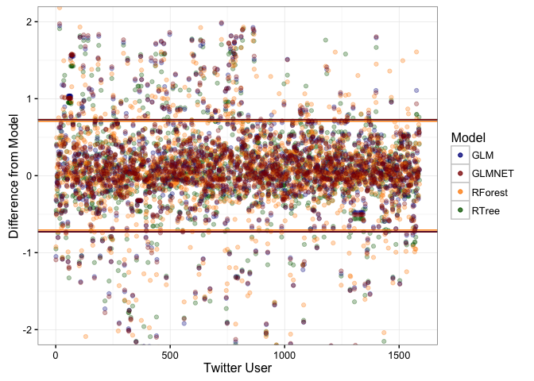

# Sentiment and Principal Component Analysis of Twitter Data: Microsoft Study
David Rodriguez  
February 24, 2016  

## Introduction

Twitter is a powerful tool that enables users to communicate with others and also empowers data scientists with large quantities of data they can use. Communications on twitter are live and dynamic, changing every second. They are also short, limited to 140 characters. The analysis of such short, fast-moving data can reveal how people communicate on a particular subject.

For example, by mining Twitter search data one can explore trends of stock prices against sentiments or specific words. One can also explore what makes a popular tweet, an excersize that can lead to efficient social media marketing. One can also compare tweets for different search terms, such as for different companies, and identfy what makes people excited about them or what their more prominent complaints are.

For this analysis, I have chosen to gather recent English-language tweets containing the word 'microsoft'. This allows me to explore how people regard the microsoft brand, as well as how they treat any news articles referring to microsoft. 
The end goal of my study was to attempt to **predict how users would tweet about the specified subject** based on user information publicly available for Twitter accounts.

## Experiment Setup

Load up required packages:

```r
library(ggplot2)
library(twitteR)
library(tm)
library(rjson)
library(wordcloud)
library(dplyr)
library(caret)
library(knitr)
library(RColorBrewer)
library(stringr)
library(syuzhet) # for sentiment analysis
library(rattle)
library(lubridate)
library(rpart)
library(randomForest)
library(glmnet)
```

To access twitter, I need to provide authorization credentials for my Twitter application:

```r
secrets <- fromJSON(file='twitter_secrets.json.nogit')

setup_twitter_oauth(secrets$api_key,
                    secrets$api_secret,
                    secrets$access_token,
                    secrets$access_token_secret)
```

```
## [1] "Using direct authentication"
```

Perform a twitter search and extract the information I want:

```r
searchstring <- 'microsoft'
numtweets <- 10000
st <- searchTwitter(searchstring, n=numtweets, resultType = 'recent', lang = 'en')

statuses <- data.frame(text=sapply(st, function(x) x$getText()),
                       user=sapply(st, function(x) x$getScreenName()),
                       RT=sapply(st, function(x) x$isRetweet),
                       latitude=sapply(st, function(x) as.numeric(x$latitude[1])),
                       longitude=sapply(st, function(x) as.numeric(x$longitude[1])),
                       time=sapply(st, function(x) format(x$created, format='%F %T'))
                       )
```

Remove retweets for clarity:

```r
statuses <-
    statuses %>%
    filter(!RT)
```

Save tweets for future use:

```r
today <- format(Sys.time(), '%Y-%m-%d')
savename <- paste0('data/tweets_',searchstring,'_',
                   nrow(statuses),'_',today,'.Rda')
saveRDS(statuses, file=savename)
```

Alternatively, I load up prior searches to avoid re-running:

```r
files <- list.files('data','tweets_')
searchstring <- 'microsoft'
rm(statuses)
```

```
## Warning in rm(statuses): object 'statuses' not found
```

```r
for(i in 1:length(files)) {
    selectedfile <- paste0('data/',files[i])
    if(!exists('statuses')){
        statuses <- readRDS(file=selectedfile)
    }else{
        statuses <- rbind(statuses, readRDS(file=selectedfile))
    }
}
```

Total number of tweets to process is 13132

## Text Analysis

Gather the tweets:

```r
textdata <- Corpus(VectorSource(statuses$text))

textdata <- 
    textdata %>%
    tm_map(removeWords, stopwords("english"), mc.cores=1) %>%
    tm_map(removePunctuation, mc.cores=1) %>%
    tm_map(content_transformer(function(x) iconv(x, to='UTF-8-MAC', sub='byte')),
           mc.cores=1) %>%
    tm_map(content_transformer(tolower), mc.cores=1) %>%
    tm_map(content_transformer(function(x) str_replace_all(x, "@\\w+", "")), 
           mc.cores=1) %>% # remove twitter handles
    tm_map(removeNumbers, mc.cores=1) %>%
    tm_map(stemDocument, mc.cores=1) %>%
    tm_map(stripWhitespace, mc.cores=1)

save(textdata, file = 'data/testdata_corpus.RData') 
rm(textdata)
```


```r
load('data/testdata_corpus.RData') 
```

A quick wordcloud of the tweets reveals the 100 most commonly used words:

```r
pal2 <- brewer.pal(8,"RdBu")
wordcloud(textdata, max.words = 100, colors= pal2, random.order=F, 
          rot.per=0.1, use.r.layout=F)
```

 

I perform a sentiment analysis on the text data by comparing the words with those from the [NRC Word-Emotion Association Lexicon](http://saifmohammad.com/WebPages/NRC-Emotion-Lexicon.htm), which assigns them to 8 emotions (eg, anger, joy, etc) and 2 sentiments (postive and negative). I create a new variable, positivity, which is the difference between the positive and negative sentiments.

```r
sentiments <- sapply(textdata, function(x) get_nrc_sentiment(as.character(x)))

sentiments <- as.data.frame(aperm(sentiments)) # transpose and save as dataframe
sentiments <- as.data.frame(lapply(sentiments, as.numeric)) # a bit more to organize
sentiments <-
    sentiments %>%
    mutate(positivity = positive - negative)
```

Here are the emotions expressed in these tweets:

```r
emotions <- data.frame("count"=colSums(sentiments[,c(1:8)]))
emotions <- cbind("sentiment" = rownames(emotions), emotions)

ggplot(data = emotions, aes(x = sentiment, y = count)) +
    geom_bar(aes(fill = sentiment), stat = "identity") +
    xlab("Sentiment") + ylab("Total Count") + 
    scale_fill_brewer(palette='RdBu') + 
    theme_bw() + theme(legend.position='none')
```

 

Further processing to get word counts:

```r
dtm <- DocumentTermMatrix(textdata)
dtm <- inspect(dtm)

save(dtm, file = 'data/DocumentTermMatrix.RData') 
rm(dtm)
```


```r
load('data/DocumentTermMatrix.RData') 
```

Sort in descending order to find the most common terms:

```r
words <- data.frame(term = colnames(dtm))
words$count <- colSums(dtm)

words <-
    words %>%
    arrange(desc(count))
head(words)
```

```
##        term count
## 1 microsoft 11856
## 2    window  2311
## 3      xbox  2255
## 4   hololen  1721
## 5      game  1599
## 6       new  1192
```

Convert tweets to data frame and select only the top 100 words to process:

```r
tweets <- as.data.frame(dtm)
ind <- data.frame('id'=seq.int(nrow(tweets)))
tweets <- cbind(ind, tweets)

words_100 <- as.character(words[2:101,'term'])
tweets <- tweets[,c('id',words_100)]

save(tweets, file = 'data/tweets.RData') 
rm(tweets, dtm)
```


```r
rm(dtm, textdata)
load('data/tweets.RData') 
```

## Principal Component Analysis

I'll now perform a principal component analysis on the tweet data set and join the first 5 components to the original status array. This will allow me to reduce the number of paramaters to consider. That is, rather than considering each word individually, I can consider the linear combination of all words with appropriate loading factors that effectively group them by phrases.

```r
trans <- preProcess(tweets[,2:ncol(tweets)], method=c("pca"), thresh = 0.95)
pca <- predict(trans, tweets[,2:ncol(tweets)])
statuses <- cbind(statuses, pca[,1:5], sentiments)
```

Let's examine the reprojected data:

```r
pal2 <- brewer.pal(10,"RdBu")
ggplot(statuses, aes(x=PC1, y=PC2)) + 
    geom_point(aes(fill=positivity), size=4, alpha=0.7, pch=21, stroke=1.3) + 
    scale_fill_gradientn(colours = pal2, limits=c(-5,5)) + theme_bw()
```

 

Sometimes the other principal components are more illustrative:

```r
pal2 <- brewer.pal(10,"RdBu")
ggplot(statuses, aes(x=PC2, y=PC3)) + 
    geom_point(aes(fill=positivity), size=4, alpha=0.7, pch=21, stroke=1.3) + 
    scale_fill_gradientn(colours = pal2, limits=c(-5,5)) + theme_bw()
```

 

I remove outliers, which I define as the 2% highest and lowest PC values in terms of PC1 and PC2:

```r
cutlevel <- 2/100.
cut1 <- quantile(statuses$PC1, probs=c(cutlevel,1-cutlevel))
cut2 <- quantile(statuses$PC2, probs=c(cutlevel,1-cutlevel))

statuses <- 
    statuses %>%
    filter(PC1>cut1[1] & PC1<cut1[2]) %>%
    filter(PC2>cut2[1] & PC2<cut2[2])
```

The loading factors reveal how important each term is to the principal component axes. Here are the top few terms of the first two components:

```r
loadings <- trans$rotation 
load_sqr <- loadings^2

load_sqr <- data.frame(load_sqr)
temp <- data.frame('term'=rownames(load_sqr))
load_sqr <- cbind(temp, load_sqr)
load_sqr %>%
    select(term, PC1) %>%
    arrange(desc(PC1)) %>%
    head(10) %>% kable(format='html')
```

<table>
 <thead>
  <tr>
   <th style="text-align:left;"> term </th>
   <th style="text-align:right;"> PC1 </th>
  </tr>
 </thead>
<tbody>
  <tr>
   <td style="text-align:left;"> restor </td>
   <td style="text-align:right;"> 0.0983066 </td>
  </tr>
  <tr>
   <td style="text-align:left;"> slam </td>
   <td style="text-align:right;"> 0.0977344 </td>
  </tr>
  <tr>
   <td style="text-align:left;"> epic </td>
   <td style="text-align:right;"> 0.0971905 </td>
  </tr>
  <tr>
   <td style="text-align:left;"> faith </td>
   <td style="text-align:right;"> 0.0969293 </td>
  </tr>
  <tr>
   <td style="text-align:left;"> human </td>
   <td style="text-align:right;"> 0.0939914 </td>
  </tr>
  <tr>
   <td style="text-align:left;"> ballmer </td>
   <td style="text-align:right;"> 0.0914452 </td>
  </tr>
  <tr>
   <td style="text-align:left;"> steve </td>
   <td style="text-align:right;"> 0.0911956 </td>
  </tr>
  <tr>
   <td style="text-align:left;"> dunk </td>
   <td style="text-align:right;"> 0.0891933 </td>
  </tr>
  <tr>
   <td style="text-align:left;"> former </td>
   <td style="text-align:right;"> 0.0891634 </td>
  </tr>
  <tr>
   <td style="text-align:left;"> ceo </td>
   <td style="text-align:right;"> 0.0869296 </td>
  </tr>
</tbody>
</table>

```r
load_sqr %>%
    select(term, PC2) %>%
    arrange(desc(PC2)) %>%
    head(10) %>% kable(format='html')
```

<table>
 <thead>
  <tr>
   <th style="text-align:left;"> term </th>
   <th style="text-align:right;"> PC2 </th>
  </tr>
 </thead>
<tbody>
  <tr>
   <td style="text-align:left;"> fun </td>
   <td style="text-align:right;"> 0.1589405 </td>
  </tr>
  <tr>
   <td style="text-align:left;"> csrrace </td>
   <td style="text-align:right;"> 0.1557036 </td>
  </tr>
  <tr>
   <td style="text-align:left;"> have </td>
   <td style="text-align:right;"> 0.1487819 </td>
  </tr>
  <tr>
   <td style="text-align:left;"> join </td>
   <td style="text-align:right;"> 0.1443763 </td>
  </tr>
  <tr>
   <td style="text-align:left;"> play </td>
   <td style="text-align:right;"> 0.1277830 </td>
  </tr>
  <tr>
   <td style="text-align:left;"> free </td>
   <td style="text-align:right;"> 0.1087408 </td>
  </tr>
  <tr>
   <td style="text-align:left;"> window </td>
   <td style="text-align:right;"> 0.0359545 </td>
  </tr>
  <tr>
   <td style="text-align:left;"> hololen </td>
   <td style="text-align:right;"> 0.0129898 </td>
  </tr>
  <tr>
   <td style="text-align:left;"> develop </td>
   <td style="text-align:right;"> 0.0115247 </td>
  </tr>
  <tr>
   <td style="text-align:left;"> preorder </td>
   <td style="text-align:right;"> 0.0098478 </td>
  </tr>
</tbody>
</table>

I've created a function to sample tweets across the PC spectrum.

```r
set.seed(42)
tweet_check <- function(text, pc, numbreaks=5){
    cuts <- cut(pc, numbreaks)
    #cuts <- cut(pc, breaks=quantile(pc, probs=seq(0,1,1/numbreaks)))
    temp <- data.frame(text=text, pc=pc, pc_val=cuts)
    temp <- temp %>%
        group_by(pc_val) %>%
        summarise(text=iconv(sample(text,1), to='UTF-8-MAC', sub='byte')) %>%
        filter(!is.na(pc_val))
    return(temp)
}
```

After examining some of the results, I found an interesting trend for PC2:

```r
set.seed(42)
tweet_check(statuses$text, statuses$PC2, 10) %>% kable(format='html')
```

<table>
 <thead>
  <tr>
   <th style="text-align:left;"> pc_val </th>
   <th style="text-align:left;"> text </th>
  </tr>
 </thead>
<tbody>
  <tr>
   <td style="text-align:left;"> (-4.36,-3.67] </td>
   <td style="text-align:left;"> You won't need an Xbox to play the next generation of Microsoft games - CNET: Microsoft will bring its games… https://t.co/wcXr4cbSDm |Cnet </td>
  </tr>
  <tr>
   <td style="text-align:left;"> (-3.67,-2.99] </td>
   <td style="text-align:left;"> You won't need an Xbox to play Microsoft's next generation of games https://t.co/BjA8WogLe5 </td>
  </tr>
  <tr>
   <td style="text-align:left;"> (-2.99,-2.3] </td>
   <td style="text-align:left;"> WORLD | You won't need an Xbox to play Microsoft's next generation of games | Read: https://t.co/iRMVb4pf52 via Yahoo!© News </td>
  </tr>
  <tr>
   <td style="text-align:left;"> (-2.3,-1.62] </td>
   <td style="text-align:left;"> @MoiMarkus Have you tried Office Lens? https://t.co/9Cydi5kP77 </td>
  </tr>
  <tr>
   <td style="text-align:left;"> (-1.62,-0.933] </td>
   <td style="text-align:left;"> Telstra offers 200GB free Microsoft OneDrive storage https://t.co/DuGr5ig3mf </td>
  </tr>
  <tr>
   <td style="text-align:left;"> (-0.933,-0.248] </td>
   <td style="text-align:left;"> AppOfTheDay:&quot;Voice Record+&quot;, a #WindowsPhone #App NOW FREE! on #AppDeals &amp;gt;&amp;gt; https://t.co/TWV12YmN6I https://t.co/5C4cstEpaw </td>
  </tr>
  <tr>
   <td style="text-align:left;"> (-0.248,0.436] </td>
   <td style="text-align:left;"> Measuring and evaluating visual desirability; how to measure visual appeal of a design or website: https://t.co/5WzVykYjEH </td>
  </tr>
  <tr>
   <td style="text-align:left;"> (0.436,1.12] </td>
   <td style="text-align:left;"> Microsoft Beijing Accelerator 7th Batch Demo Day - BEIJING, March BEIJING, March 1, 2016 /PRNewswire/  .. https://t.co/pVugdeujWa #microsoft </td>
  </tr>
  <tr>
   <td style="text-align:left;"> (1.12,1.8] </td>
   <td style="text-align:left;"> Microsoft's Hololens is up for pre-order, here's hoping you can expense it https://t.co/00w3rl7R8R </td>
  </tr>
  <tr>
   <td style="text-align:left;"> (1.8,2.5] </td>
   <td style="text-align:left;"> @zippylab Microsoft announces HoloLens specs, preorder dates, and what's in the Developer Edition
https://t.co/3fTvtH44ko via neowin </td>
  </tr>
</tbody>
</table>

I notice that low PC2 values tend to be about the Xbox and high PC2 values tend to be about the Hololens. This presents a possible avenue for the predictive analysis. If I can devise a model to predict the value of PC2 based on a Twitter user's data, I'll know which product they are more excited about.

## Gather User Data

To carry out my models, I'll need a lot more information. I gather all the user data for each particular tweet.

```r
userlist <- sapply(unique(statuses$user), as.character)
allusers <- lookupUsers(userlist)

# Gather all the user info in a data frame
userinfo <- data.frame(user=sapply(allusers, function(x) x$screenName),
                       realname=sapply(allusers, function(x) x$name),
                       numstatuses=sapply(allusers, function(x) x$statusesCount),
                       followers=sapply(allusers, function(x) x$followersCount),
                       friends=sapply(allusers, function(x) x$friendsCount),
                       favorites=sapply(allusers, function(x) x$favoritesCount),
                       account_created=sapply(allusers, function(x) format(x$created, 
                                                              format='%F %T')),
                       verified=sapply(allusers, function(x) x$verified),
                       numlists=sapply(allusers, function(x) x$listedCount)) %>%
    mutate(user=as.character(user)) %>%
    mutate(twitter_years=interval(account_created, Sys.time()) / dyears(1)) %>%
    select(-account_created)

save(userinfo, file='data/userinfo.Rdata')
#rm(userinfo)
```


```r
load('data/userinfo.Rdata')
```

The original tweets will now be grouped together by user (taking averages of the relevant quantities of interest) and then joined together to the user information data frame:

```r
newstatuses <-
    statuses %>%
    group_by(user) %>%
    summarize(numTopicTweets=n(),
              positivity=mean(positivity),
              PC1=mean(PC1),
              PC2=mean(PC2),
              PC3=mean(PC3),
              PC4=mean(PC4),
              PC5=mean(PC5),
              client=rownames(sort(table(client), decreasing = T))[1],
              anger=mean(anger), anticipation=mean(anticipation), 
              disgust=mean(disgust), fear=mean(fear), joy=mean(joy),
              sadness=mean(sadness), surprise=mean(surprise), trust=mean(trust)) %>% 
    mutate(user=as.character(user))

# Join the data together
alldata <- inner_join(userinfo, newstatuses, by='user')
```

## Predictive Analysis

### Setup

As described above, high and low values for the 2nd principal component appear to be related to a user's tweeting about the Xbox or Hololens. As such, I'll select it for my predictive analysis. This can readily be changed to another principal component, or the results of the sentiment analysis, for other studies.

```r
possiblepreds <- c('PC1','PC2','PC3','PC4','PC5')
choice <- 'PC2'

# Remove columns
if(T){
    colremove <- possiblepreds[sapply(possiblepreds, function(x) x!=choice)]
    col_list <- colnames(alldata)
    final_cols <- col_list[sapply(col_list, function(x) !(x %in% colremove))]
    df <- alldata[final_cols]
}else{
    df <- alldata
}

df <- df %>% 
    select(-user, -realname, -client) %>%
    select(-(anger:trust)) # removing sentiment columns
```

In the event that there are parameters with little variance, I remove them:

```r
nzv <- nearZeroVar(df)
df_filter <- df[, -nzv]
df_filter <- na.omit(df_filter)
```

There are now only 9 parameters, including PC2, for our 7944 users.

I'll now prepare my training and test data sets:

```r
set.seed(3456)
trainIndex <- sample(nrow(df_filter), nrow(df_filter)*0.8)

df_train <- df_filter[ trainIndex,]
df_test  <- df_filter[-trainIndex,]
```

### Regression Tree

First, I'll run a regression tree model:

```r
rtGrid <- expand.grid(cp=seq(0.005, 0.1, by = 0.005)) # grid of cp values
ctrl <- trainControl(method = "cv", number = 10, verboseIter = F)

toRun <- formula(paste0(choice,' ~ .'))
rtTune <- train(toRun, data = df_train, method = "rpart", 
                tuneGrid = rtGrid, trControl = ctrl)
final_tree <- rtTune$finalModel
```

The numeric values of our best fit are saved for later comparison:

```r
df_test_all <- df_test
df_test_all[,'id'] <- seq(nrow(df_test_all))
pr_rt <- predict(rtTune, newdata = df_test)
rmseTree <- RMSE(pr_rt, df_test[,choice])
modelSummary <- data.frame(model='Regression Tree',
                         RMSE=rmseTree)

df_test_all[,'diff_Tree'] = df_test_all[,choice] - pr_rt
```

### Generalized Linear Model

I next run a generalized linear model:

```r
toRun <- formula(paste0(choice,' ~ .'))
rtTune2 <- train(toRun, data = df_train, method = "glm")

summary(rtTune2)
```

The summary suggests the most significant quantities to predict the values of PC2 are the number of statuses (ie, tweets) and the positivity value. 

As before, we save the results for future comparison:

```r
pr_rt <- predict(rtTune2, newdata = df_test)
rmseGLM <- RMSE(pr_rt, df_test[,choice])
    
newRow <- data.frame(model='Generalized LM',
                     RMSE=rmseGLM)
modelSummary <- rbind(modelSummary, newRow)
    
df_test_all[,'diff_GLM'] = df_test_all[,choice] - pr_rt
```

### Random Forest

Next, I run a random forest model:

```r
rtGrid = expand.grid(mtry=seq(3, 7, by = 1)) # grid of mtry values
ctrl <- trainControl(method = "cv", number = 5, verboseIter = F)

toRun <- formula(paste0(choice,' ~ .'))
rtTune3 <- train(toRun, data = df_train, 
                method = "rf",
                tuneGrid = rtGrid,
                trControl = ctrl, importance=T)
```

The best random forest model considers 3 random parameters at each split. This is the overall importance of the various parameters:

```r
varImp(rtTune3)
```

```
## rf variable importance
## 
##                Overall
## positivity      100.00
## numlists         61.42
## followers        48.05
## numstatuses      41.74
## favorites        32.22
## twitter_years    22.83
## friends          22.06
## numTopicTweets    0.00
```


```r
pr_rt <- predict(rtTune3, newdata = df_test)
rmseRF <- RMSE(pr_rt, df_test[,choice])
    
newRow <- data.frame(model='Random Forest',
                     RMSE=rmseRF)
modelSummary <- rbind(modelSummary, newRow)
    
df_test_all[,'diff_RF'] = df_test_all[,choice] - pr_rt
```

### GLMNET

Finally, I consider another generalized linear model with an elastic-net penalty that controls whether we are considering a lasso or ridge regression:

```r
enetGrid <- expand.grid(.alpha = c(0, 0.1, 0.5, 0.7, 1), 
                        .lambda = seq(0, 5, by = 0.1))

ctrl <- trainControl(method = "cv", number = 10, verboseIter = F)

toRun <- formula(paste0(choice,' ~ .'))
rtTune4 <- train(toRun, data = df_train,    
                  method = "glmnet", 
                  tuneGrid = enetGrid,
                  trControl = ctrl)
```

The best alpha and lambda parameters for the GLMNET model are 0.1, 0.1


```r
pr_rt <- predict(rtTune4, newdata = df_test)
rmseGLMNET <- RMSE(pr_rt, df_test[,choice])
    
newRow <- data.frame(model='GLMNET',
                     RMSE=rmseGLMNET)
modelSummary <- rbind(modelSummary, newRow)
    
df_test_all[,'diff_GLMNET'] = df_test_all[,choice] - pr_rt
```


## Model Comparison

The figure below compares the result of the various models:

```r
cols <- c("RTree"="dark green", "GLM"="dark blue",
          "RForest"="dark orange", "GLMNET"="dark red")
alphalvl <- 0.3
ggplot(data=df_test_all, aes(x=id)) +
    geom_point(aes(y=diff_Tree, color='RTree'), alpha=alphalvl) + 
    geom_hline(yintercept=c(rmseTree, -1*rmseTree), color=cols['RTree']) +
    geom_point(aes(y=diff_GLM, color='GLM'), alpha=alphalvl) + 
    geom_hline(yintercept=c(rmseGLM, -1*rmseGLM), color=cols['GLM']) +
    geom_point(aes(y=diff_RF, color='RForest'), alpha=alphalvl) + 
    geom_hline(yintercept=c(rmseRF, -1*rmseRF), color=cols['RForest']) +
    geom_point(aes(y=diff_GLMNET, color='GLMNET'), alpha=alphalvl) + 
    geom_hline(yintercept=c(rmseGLMNET, -1*rmseGLMNET), color=cols['GLMNET']) +
    theme_bw() + coord_cartesian(ylim=c(-2,2)) + 
    scale_colour_manual(name="Model",values=cols) +
    labs(x='Twitter User', y='Difference from Model')
```

 

Here is a table of the root mean square errors (RMSE), a measure of the goodness-of-fit:

```r
modelSummary %>% kable(format='html')
```

<table>
 <thead>
  <tr>
   <th style="text-align:left;"> model </th>
   <th style="text-align:right;"> RMSE </th>
  </tr>
 </thead>
<tbody>
  <tr>
   <td style="text-align:left;"> Regression Tree </td>
   <td style="text-align:right;"> 0.7290474 </td>
  </tr>
  <tr>
   <td style="text-align:left;"> Generalized LM </td>
   <td style="text-align:right;"> 0.7281301 </td>
  </tr>
  <tr>
   <td style="text-align:left;"> Random Forest </td>
   <td style="text-align:right;"> 0.7065228 </td>
  </tr>
  <tr>
   <td style="text-align:left;"> GLMNET </td>
   <td style="text-align:right;"> 0.7291258 </td>
  </tr>
</tbody>
</table>

All models perform comparably similar with regards to the RMSE. As I discuss below, there may be a few ways to improve the models in order to yield more accurate results.

## Summary

I have looked at tweets concerning microsoft and have identified that the second principal component (PC2) appears to be relevant to sorting tweets by whether or not they are excited about the Hololens product or Xbox games on their personal computers. 
While in principle, there are a lot of tweets and variations, I chose to use PC2 as a measure of the phrases used and developed a set of models to attempt to predict what values of PC2 a user would have. 

This approach can be useful to determine what types of users are excited about the Hololens and which are excited about Xbox games (in this example) and can suggest targetted advertizing.

Let's have a look at the regression tree as it's one of the clearest to describe:

```r
fancyRpartPlot(final_tree, palettes=c("Blues"), sub='')
```

 

The above suggests that users with very negative PC2 values (associated with excitement about the Xbox product) also have very few followers and have been on Twitter a very small amount of time. This suggest these types of users are actually Twitter robot accounts created to spam advertisement on this particular Xbox news story. I would argue it's safe to disregard spending any advertising efforts on these users.

On the other hand, for higher PC2 values (associated with excitement about the Hololens product), we can see more meaningful information. The value of PC2 for a user depends on the postivity, which is a measure on how often positive and negative words are used; the number of statuses or tweets they've had; the number of lists they follow; and the number of Twitter favorites they have.

While these models can predict the values of PC2, their errors remain fairly large. I interpret this as the PC2 value having large variation in terms of the word choices used to construct the individual tweets.
A possible way to improve these models would be to consider more parameters given that we have enough data to support this. These additional parameters could come from twitter or from external sources.
Another possibility is to re-examine our source of data. Rather than gathering 'recent' tweets, we could have gathered 'popuplar' or 'mixed' tweets, which would rely on Twitter's algorithms to return a different sample of tweets. 
Yet another possibility would be to consider a different API, such as gathering data from Facebook.

## Conclusions

In the end, while this project demonstrated a potential relationship between word choice and differentiation between Microsoft products, it can readily be expanded to any other topic of interest. However, given the varied nature of tweeted topics within a search, it is not always clear that a trend can or will emerge.

Alternative ways in which Twitter data could be used include:

 * Examining trends of stock market prices with respect to word choices or overall sentiment in Twitter
 * Determining what properties of a tweet or user make for the most popular tweets in order to best market your product
 * Comparing two search terms for two separate companies to identify and address any issues or complaints
 * Exploring tweets by location to find popular venues or events
